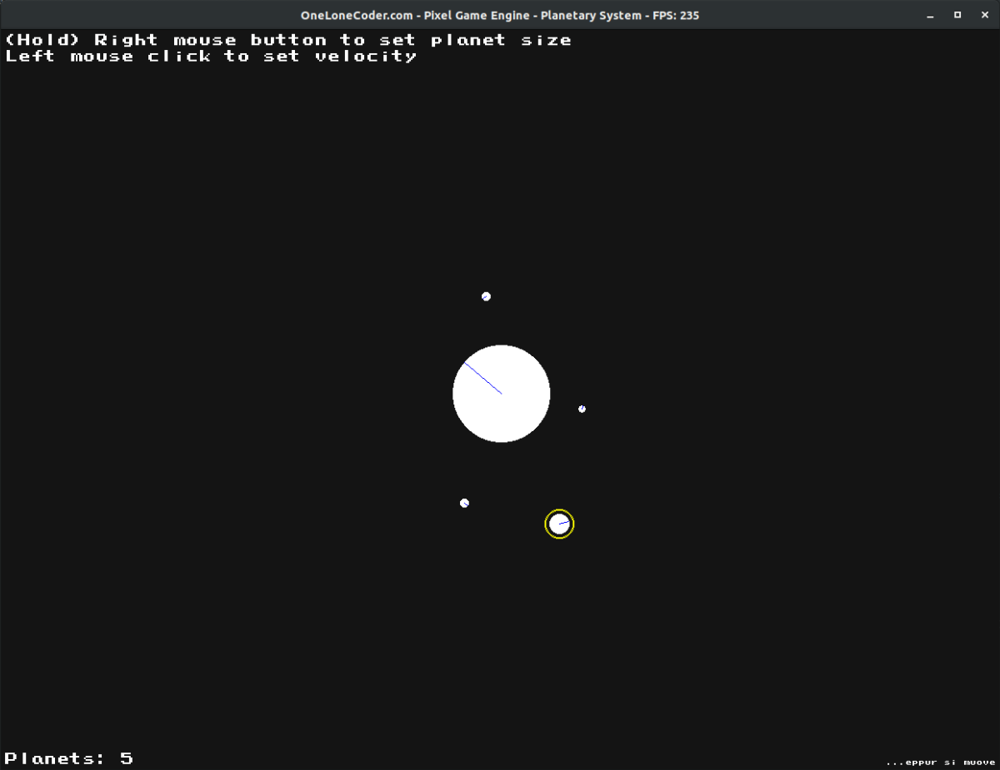
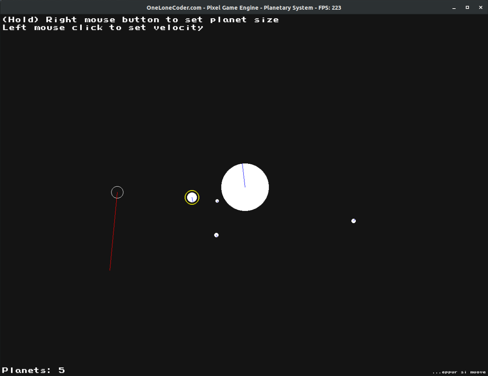

# olcPlanetarySystem
A simple interactive application for N-body planetary system model simulation made in the olcPixelGameEngine

## Description
An interactive canvas allowing one to click to create a new planet and set its initial velocity. Gravity handles the rest. Selecting a planet allows to delete it. Planets wandering to far away are lost forever.

## Install
The makefile attached provides all flags for compilation, considering Linux OS, 
requiring only a `make` command. Although olcPGE is multiplatform, this code is 
primarily made for Linux OS, without any testing in Windows, however, it shall be 
trivially portable. 

In order to run on Linux, the application must be executed with `vblank_mode=0 ./application`, 
avoiding FPS locking. The olcPGE compilation requires basic obtainable libraries, which 
can be retrieved in Ubuntu with:

`sudo apt install build-essential libglu1-mesa-dev libpng-dev`

More information for other distros can be found at:
https://github.com/OneLoneCoder/olcPixelGameEngine/wiki/Compiling-on-Linux

# Credits
This application is fully developed from and for the olcPixelGameEngine, as provided 
by Javidx9, the One Lone Coder https://github.com/OneLoneCoder/olcPixelGameEngine. 
The original README and LICENSE files can be found attached, along with further details 
in the engine header file.

